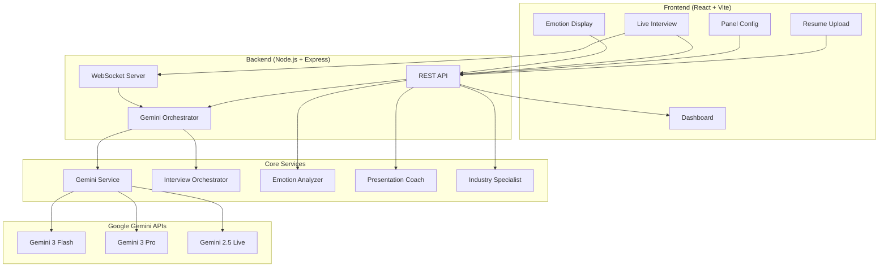
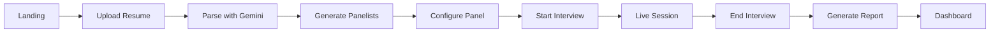
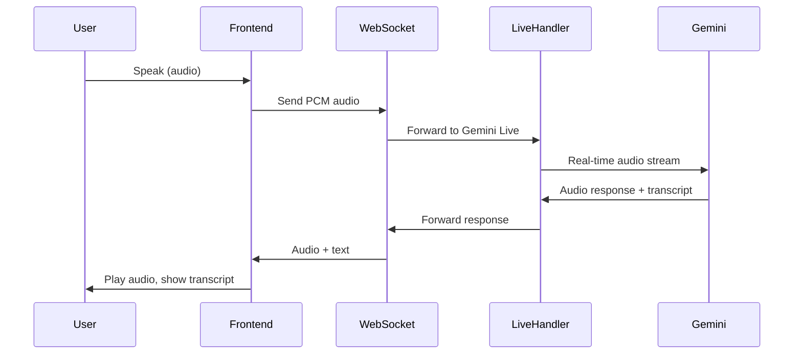
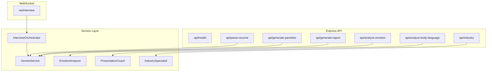
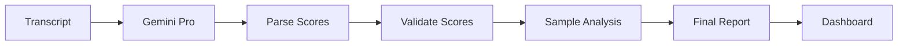

# InterviewOS

**AI-Powered Interview Preparation Platform with Multi-Panelist Simulation & Real-Time Evaluation**

[](https://ai.google.dev/)
[](https://www.typescriptlang.org/)
[](https://react.dev/)
[](https://nodejs.org/)

---

## Overview

InterviewOS is an AI-powered interview preparation platform that simulates multi-panelist interviews with real-time audio/video, adaptive questioning, and comprehensive evaluation feedback. Powered by Google Gemini 3, it provides:

- **Adaptive AI Interviewers** — 3 distinct panelists with unique personalities and question styles
- **Real-Time Live Session** — Gemini Live API for ultra-low latency audio conversation
- **Emotion & Presentation Coaching** — Confidence, nervousness, body language analysis
- **Industry Specialization** — FAANG, Finance, Consulting, Medical, Legal, Startup prep
- **Comprehensive Analytics** — Multi-dimensional scoring, improvements, and panelist feedback

---

## Architecture

### Main System Architecture



### User Flow



### Data Flow: Interview Session



### Backend Architecture



### Evaluation Pipeline



---

## Features

| Feature | Description |
|--------|-------------|
| **Resume Parsing** | PDF, DOC, DOCX support — extracts skills, experience, education |
| **Panel Generation** | 3 AI interviewers with Indian names, distinct personalities, gender-matched voices |
| **Live Interview** | Real-time audio via Gemini Live API, streaming transcription |
| **Adaptive Depth** | 5-level question depth (intro → base → deep) based on responses |
| **Difficulty Levels** | Easy, Medium, Hard, Extreme — affects tone and probing |
| **Emotion Analysis** | Confidence, nervousness, enthusiasm from transcript/audio |
| **Body Language** | Posture, eye contact, gestures (sample data due to API limits) |
| **Report Generation** | Technical, Communication, Culture Fit scores + panelist comments |
| **Sample Analytics** | Body/voice/temporal analysis derived from score (with API-limits warning) |

---

## Quick Start

### Prerequisites

- **Node.js** 20+
- **Gemini API Key** — [Get one here](https://ai.google.dev/)
- **npm** or **yarn**

### Installation

```bash
# Clone
git clone https://github.com/yourusername/InterviewOS.git
cd InterviewOS

# Frontend
npm install

# Backend
cd server && npm install && cd ..
```

### Environment

**Backend** (`server/.env`):

```env
GEMINI_API_KEY=your_gemini_api_key
PORT=3001
CLIENT_URL=http://localhost:3000
```

**Frontend** (`.env` or `.env.local`):

```env
VITE_MIN_INTERVIEW_DURATION_SECONDS=30
```

### Run

```bash
# Terminal 1 — Backend
cd server && npm run dev

# Terminal 2 — Frontend
npm run dev
```

- **Frontend**: http://localhost:3000
- **Backend**: http://localhost:3001
- **WebSocket**: ws://localhost:3001/ws/interview

---

## API Reference

### Core Endpoints

| Method | Endpoint | Description |
|--------|----------|-------------|
| `GET` | `/api/health` | Health check |
| `POST` | `/api/parse-resume` | Parse resume (PDF/DOC/DOCX) |
| `POST` | `/api/generate-panelists` | Generate AI interviewers |
| `POST` | `/api/generate-report` | Generate evaluation report |

### Advanced Endpoints

| Method | Endpoint | Description |
|--------|----------|-------------|
| `POST` | `/api/analyze-emotion` | Emotion & sentiment analysis |
| `POST` | `/api/analyze-body-language` | Body language analysis |
| `GET` | `/api/industry/:industry` | Industry profile |
| `POST` | `/api/industry-questions` | Industry-specific questions |
| `POST` | `/api/industry-evaluate` | Industry evaluation |

### WebSocket

| Path | Description |
|------|-------------|
| `ws://localhost:3001/ws/interview` | Live interview session |

---

## Tech Stack

| Layer | Technologies |
|-------|---------------|
| **Frontend** | React 18, TypeScript, Vite, Tailwind CSS, Recharts, Axios |
| **Backend** | Node.js 20, Express, WebSocket (ws), Multer |
| **AI** | Gemini 3 Flash, Gemini 3 Pro, Gemini 2.5 Flash Live |
| **Services** | GeminiService, InterviewOrchestrator, EmotionAnalyzer, PresentationCoach, IndustrySpecialist |

---

## Project Structure

```
InterviewOS/
├── components/          # React UI components
│   ├── LiveInterview.tsx
│   ├── Dashboard.tsx
│   ├── PanelConfiguration.tsx
│   └── ResumeUploader.tsx
├── server/
│   └── src/
│       ├── index.ts              # Express + WebSocket entry
│       ├── services/
│       │   ├── geminiService.ts
│       │   ├── interviewOrchestrator.ts
│       │   ├── emotionAnalyzer.ts
│       │   ├── presentationCoach.ts
│       │   └── industrySpecialist.ts
│       └── websocket/
│           └── liveInterviewHandler.ts
├── src/
│   ├── services/apiClient.ts
│   ├── hooks/useVideoAnalysis.ts
│   └── utils/reportDownload.ts
├── types.ts
└── vite.config.ts
```

---

## Gemini Models

| Use Case | Model | Note |
|----------|-------|------|
| Resume parsing | `gemini-3-flash-preview` | Fast extraction |
| Panelist generation | `gemini-3-flash-preview` | Persona creation |
| Final evaluation | `gemini-3-pro-preview` | Deep reasoning |
| Live interview | `gemini-2.5-flash-native-audio-preview` | Only model with Live API |

---

## Sample Data Notice

Body language, voice, temporal, and spatial analysis use **sample/demonstration data** due to API rate limits on the free tier. Core scores (Technical, Communication, Culture Fit) and panelist feedback are based on your actual interview transcript.

---

## License

MIT License — see LICENSE file for details.
