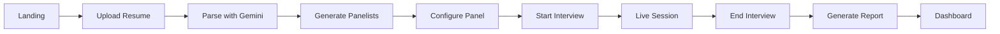
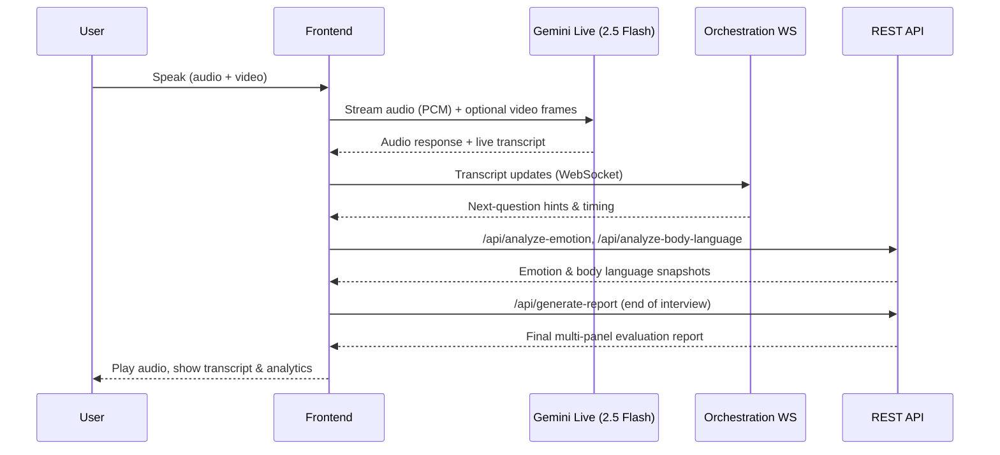
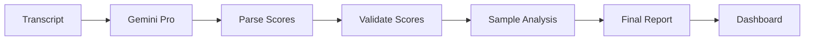

# InterviewOS

**AI-Powered Interview Preparation Platform with Multi-Panelist Simulation & Real-Time Evaluation**

[](https://ai.google.dev/)
[](https://www.typescriptlang.org/)
[](https://react.dev/)
[](https://nodejs.org/)

---

## Overview

InterviewOS is an AI-powered interview preparation platform that simulates multi-panelist interviews with real-time audio/video, adaptive questioning, and comprehensive evaluation feedback. Powered by Google Gemini 3, it provides:

- **Adaptive AI Interviewers** — 3 distinct panelists with unique personalities and question styles
- **Real-Time Live Session** — Gemini Live API for ultra-low latency audio conversation
- **Emotion & Presentation Coaching** — Confidence, nervousness, body language analysis
- **Industry Specialization** — FAANG, Finance, Consulting, Medical, Legal, Startup prep
- **Comprehensive Analytics** — Multi-dimensional scoring, improvements, and panelist feedback

**Hackathon Alignment:** See **[How InterviewOS Aligns with the Gemini 3 Hackathon](#how-interviewos-aligns-with-the-gemini-3-hackathon)** for how this project is tailored to the official tracks and judging criteria.

---

## Architecture

### Main System Architecture

```mermaid
flowchart TB
    subgraph Client["Frontend (React + Vite)"]
        RU[Resume Upload]
        PC[Panel Config]
        LI[Live Interview]
        EM[Emotion & Body Language]
        DB[Dashboard]
    end

    subgraph Backend["Backend (Node.js + Express)"]
        REST[REST API]
        WS[Orchestration WS (/ws/interview)]
    end

    subgraph Services["Core Services"]
        GS[GeminiService]
        IO[InterviewOrchestrator]
        EA[EmotionAnalyzer]
        PC2[PresentationCoach]
        IS[IndustrySpecialist]
    end

    subgraph Gemini["Google Gemini APIs"]
        GF[Gemini 3 Flash]
        GP[Gemini 3 Pro]
        GL[Gemini 2.5 Flash Live]
    end

    RU --> REST
    PC --> REST
    LI --> GL
    EM --> REST
    DB --> REST

    REST --> GS
    REST --> EA
    REST --> PC2
    REST --> IS

    LI --> WS
    WS --> IO
    IO --> GS

    GS --> GF
    GS --> GP
```

### User Flow


```mermaid
flowchart LR
    A[Landing] --> B[Upload Resume]
    B --> C[Parse with Gemini]
    C --> D[Generate Panelists]
    D --> E[Configure Panel]
    E --> F[Start Interview]
    F --> G[Live Session]
    G --> H[End Interview]
    H --> I[Generate Report]
    I --> J[Dashboard]
```

### Data Flow: Interview Session


```mermaid
sequenceDiagram
    participant User
    participant Frontend
    participant GeminiLive as Gemini Live (2.5 Flash)
    participant Orchestrator as Orchestration WS
    participant REST as REST API

    User->>Frontend: Speak (audio + video)
    Frontend->>GeminiLive: Stream audio (PCM) + optional video frames
    GeminiLive-->>Frontend: Audio response + live transcript

    Frontend->>Orchestrator: Transcript updates (WebSocket)
    Orchestrator-->>Frontend: Next-question hints & timing

    Frontend->>REST: /api/analyze-emotion, /api/analyze-body-language
    REST-->>Frontend: Emotion & body language snapshots

    Frontend->>REST: /api/generate-report (end of interview)
    REST-->>Frontend: Final multi-panel evaluation report

    Frontend-->>User: Play audio, show transcript & analytics
```

### Backend Architecture

```mermaid
flowchart TB
    subgraph API["Express API"]
        H[GET /api/health]
        P[POST /api/parse-resume]
        G[POST /api/generate-panelists]
        R[POST /api/generate-report]
        E[POST /api/analyze-emotion]
        B[POST /api/analyze-body-language]
        S[POST /api/analyze-speech]
        I[GET /api/industry/:industry]
        IQ[POST /api/industry-questions]
        IE[POST /api/industry-evaluate]
    end

    subgraph WS["WebSocket"]
        LI[ws/interview (orchestration only)]
    end

    subgraph Core["Service Layer"]
        GS[GeminiService]
        IO[InterviewOrchestrator]
        EA[EmotionAnalyzer]
        PC[PresentationCoach]
        IS[IndustrySpecialist]
    end

    P --> GS
    G --> GS
    R --> GS
    E --> EA
    B --> PC
    S --> PC
    I --> IS
    IQ --> IS
    IE --> IS

    LI --> IO
    IO --> GS
```

### Evaluation Pipeline


```mermaid
flowchart LR
    T[Transcript] --> G[Gemini Pro]
    G --> S[Parse Scores]
    S --> V[Validate Scores]
    V --> SA[Sample Analysis]
    SA --> R[Final Report]
    R --> D[Dashboard]
```

---

## Features

| Feature | Description |
|--------|-------------|
| **Resume Parsing** | Upload a resume file and extract skills, experience, education |
| **Panel Generation** | 3 AI interviewers with Indian names, distinct personalities, gender-matched voices |
| **Live Interview** | Real-time audio via Gemini Live API, streaming transcription |
| **Adaptive Depth** | 5-level question depth (intro → base → deep) based on responses |
| **Difficulty Levels** | Easy, Medium, Hard, Extreme — affects tone and probing |
| **Emotion Analysis** | Confidence, nervousness, enthusiasm from transcript/audio |
| **Body Language** | Posture, eye contact, gestures (sample data due to API limits) |
| **Report Generation** | Technical, Communication, Culture Fit scores + panelist comments |
| **Sample Analytics** | Body/voice/temporal analysis derived from score (with API-limits warning) |

---

## API Reference

### Core Endpoints

| Method | Endpoint | Description |
|--------|----------|-------------|
| `GET` | `/api/health` | Health check |
| `POST` | `/api/parse-resume` | Parse resume and extract structured profile |
| `POST` | `/api/generate-panelists` | Generate AI interviewers |
| `POST` | `/api/generate-report` | Generate evaluation report |

### Advanced Endpoints

| Method | Endpoint | Description |
|--------|----------|-------------|
| `POST` | `/api/analyze-emotion` | Emotion & sentiment analysis |
| `POST` | `/api/analyze-body-language` | Body language analysis |
| `POST` | `/api/analyze-speech` | Speech patterns & filler word analysis |
| `GET` | `/api/industry/:industry` | Industry profile |
| `POST` | `/api/industry-questions` | Industry-specific questions |
| `POST` | `/api/industry-evaluate` | Industry evaluation |

### WebSocket

| Path | Description |
|------|-------------|
| `ws://localhost:3001/ws/interview` | Live interview session |

---

## Tech Stack

| Layer | Technologies |
|-------|---------------|
| **Frontend** | React 19, TypeScript 5.8, Vite, Tailwind CSS, Recharts, Axios, Framer Motion |
| **Backend** | Node.js 20+, Express, WebSocket (`ws`), Multer, dotenv |
| **AI** | Gemini 3 Flash, Gemini 3 Pro, Gemini 2.5 Flash Live (browser) |
| **Services** | `GeminiService`, `InterviewOrchestrator`, `EmotionAnalyzer`, `PresentationCoach`, `IndustrySpecialist` |

---

## Project Structure

```
InterviewOS/
├── components/          # React UI components
│   ├── LiveInterview.tsx
│   ├── Dashboard.tsx
│   ├── PanelConfiguration.tsx
│   └── ResumeUploader.tsx
├── server/
│   └── src/
│       ├── index.ts              # Express + WebSocket entry
│       ├── services/
│       │   ├── geminiService.ts
│       │   ├── interviewOrchestrator.ts
│       │   ├── emotionAnalyzer.ts
│       │   ├── presentationCoach.ts
│       │   └── industrySpecialist.ts
│       └── websocket/
│           └── liveInterviewHandler.ts
├── src/
│   ├── components/
│   │   └── ErrorBoundary.tsx
│   ├── constants/
│   │   └── index.ts
│   ├── hooks/
│   │   ├── useVideoAnalysis.ts
│   │   └── useVAD.ts
│   ├── services/
│   │   └── apiClient.ts
│   ├── utils/
│   │   ├── reportDownload.ts
│   │   └── sessionStorage.ts
│   └── index.css
├── utils/
│   └── audioUtils.ts
├── types.ts
└── vite.config.ts
```

---

## Deploy to Heroku

### Prerequisites

- A [Heroku](https://heroku.com) account
- [Heroku CLI](https://devcenter.heroku.com/articles/heroku-cli) installed
- A [Google Gemini API key](https://ai.google.dev/)

### One-Click Deploy

[](https://heroku.com/deploy)

### Manual Deploy

```bash
# 1. Login to Heroku
heroku login

# 2. Create a new Heroku app
heroku create your-app-name

# 3. Set required environment variables
heroku config:set GEMINI_API_KEY=your_gemini_api_key_here
heroku config:set NODE_ENV=production

# 4. Deploy
git push heroku main

# 5. Open the app
heroku open
```

### Environment Variables

| Variable | Required | Description |
|----------|----------|-------------|
| `GEMINI_API_KEY` | Yes | Google Gemini API key |
| `NODE_ENV` | No | Set automatically to `production` by Heroku |
| `PORT` | No | Set automatically by Heroku |

> **Note:** On Heroku the frontend is served as static files from the Express backend, so `CLIENT_URL` is not needed.

---

## Gemini Models

| Use Case | Model | Note |
|----------|-------|------|
| Resume parsing | `gemini-3-flash-preview` | Fast extraction |
| Panelist generation | `gemini-3-flash-preview` | Persona creation |
| Final evaluation | `gemini-3-pro-preview` | Deep reasoning |
| Live interview | `gemini-2.5-flash-native-audio-preview-12-2025` | Native audio Live API (browser) |

---

## Sample Data Notice

Body language, voice, temporal, and spatial analysis use **sample/demonstration data** due to API rate limits on the free tier. Core scores (Technical, Communication, Culture Fit) and panelist feedback are based on your actual interview transcript.

---

## Design & Optimization Highlights

- **Robust Gemini integration**
  - **Typed JSON schemas** for resume parsing, panel generation, and reports using `responseSchema` to avoid parsing errors.
  - **Retry with exponential backoff** in `GeminiService` for transient failures while avoiding retries on 4xx client errors.
  - **Sample analytics layer** adds body/voice/temporal trends with an explicit warning when real APIs are rate-limited.

- **Low-latency live interview pipeline**
  - **Native audio worklet** pipeline at 16 kHz with ScriptProcessor fallback and smaller buffer size for reduced round-trip latency.
  - **Pre-decoding and queueing of audio chunks** (lookahead buffers) for smoother, gap-free panelist speech playback.
  - **Client-side VAD (voice activity detection)** to detect end-of-speech quickly and trigger Gemini responses sooner.
  - **Latency instrumentation hooks** that log time-to-first-token and audio start to continuously tune performance.

- **Multi-panel orchestration & flow control**
  - Dedicated **`InterviewOrchestrator` service** that tracks topics, depth (1–5), and panelist balance to suggest the next question.
  - **WebSocket orchestration sidecar** (`/ws/interview`) that receives transcript snapshots and returns structured hints without touching audio.
  - **Dynamic panel handoff protocol** (`[PASS: Name]` tags) with pre-warmed sessions so panelists can switch with minimal delay.

- **Emotion, body language, and speech analysis**
  - Frontend **`useVideoAnalysis` hook** records short VP8 segments on a timer and sends them to `/api/analyze-body-language`, guarded to avoid overlapping requests.
  - Backend **rate limiting & safe defaults** for `/api/analyze-emotion` and `/api/analyze-body-language` to stay responsive when APIs throttle.
  - Separate **speech pattern analysis endpoint** (`/api/analyze-speech`) for pacing, filler words, and clarity.

- **Industry-specialized evaluation**
  - **`IndustrySpecialist` service** encodes profiles for FAANG, Finance, Consulting, Medical, Legal, Startup, and General.
  - Generates **industry-specific questions and evaluations** (scores, strengths, weaknesses, recommendations) using Gemini Pro.

- **Resilience & UX considerations**
  - **Minimum interview duration guard** before final report generation to avoid over-scoring very short sessions.
  - **StrictMode-safe initialization** in `LiveInterview` to prevent duplicate session creation in React 19 dev mode.
  - Graceful cleanup of WebSocket, media streams, and audio contexts when an interview ends.

---

## How InterviewOS Aligns with the Gemini 3 Hackathon

InterviewOS was designed specifically for the **Google DeepMind Gemini 3 Hackathon**, and adheres to the spirit of the official rules and tracks:

- **New, Gemini 3–centric application**
  - Built as a **new application** around the Gemini 3 family (Flash, Pro) and **Gemini 2.5 Live** for real-time audio.
  - Uses Gemini not as a “prompt-only wrapper”, but as the core engine for **resume understanding, panelist generation, orchestration, and evaluation**.

- **Aligned with Action Era & strategic tracks**
  - Implements a **Marathon Agent–style orchestrator** (`InterviewOrchestrator`) that maintains long-running interview state, depth, and topic coverage over time.
  - Uses **real-time multimodal input** (audio + video) with Gemini Live for the **Real-Time Teacher** / coaching pattern: adaptive questioning plus feedback on delivery.
  - Focuses on **autonomous flow control** (phase management, panel rotation, dynamic handoffs) rather than a single-shot chat interaction.

- **Avoids discouraged patterns**
  - Not a baseline RAG demo, generic chatbot, or simple vision analyzer; instead it:
    - Streams audio and video, evaluates multi-dimensional performance, and drives an evolving conversation.
    - Adds a dedicated orchestration WS layer and industry-specific services on top of the raw models.

- **Built to the judging criteria**
  - **Technical Execution (40%)**: Typed Gemini integrations, retry logic, orchestration WS, audio worklets, and frontend hooks for VAD/video analysis.
  - **Potential Impact (20%)**: Targets a broad, high-value use case—structured, repeatable mock interviews with analytics for any professional track.
  - **Innovation / Wow Factor (30%)**: Multi-panel AI interviewers, dynamic handoffs, temporal analytics, and industry-specialized scoring.
  - **Presentation / Demo (10%)**: Clear architecture diagrams, documented flows, and a UI tuned for live demos and screencasts.

---

## License

MIT License — see LICENSE file for details.
